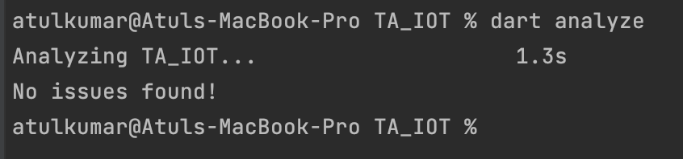
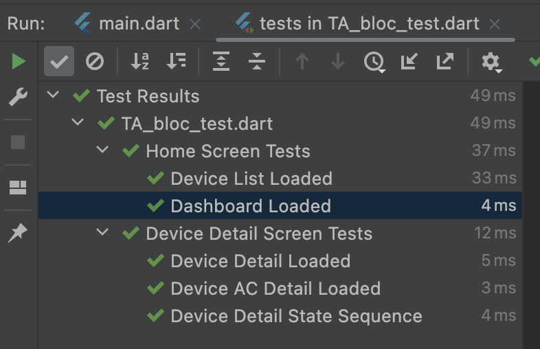

# Tata Digital IOT App

This app shows list of IOT home devices. It helps to view information, status of devices and to control the devices from within the app.

# App Resources
Please check below link for Android APK, Screenshots & videos.
[Link - Click Here](https://drive.google.com/drive/folders/1uCT6R2ycKdQBgJ7NsSjDj-S77zccre6z?usp=sharing)

# Contents
1. TA IOT Task Management App Features.
2. Architectural Design
3. Folder Structure
4. Data Flow
5. Test Results
6. Non-Functional Requirements
7. Supported Platforms

# TA IOT Task Management App Features.
1. Dashboard showing essential parameters (Temperature, Humidity, No. of devices etc..)
2. List of AC, TV and other devices.
3. We can turn ON/Off device from the device list.
4. Click on particular device to get device detail.
5. TV Device - Switch ON/Off, Brightness, Contrast, Volume Options.
6. TV Device - Change picture & sound modes.
7. Supported Picture modes - (Dynamic, Standard, HDR Standard, HDR Cinema).
8. Supported Sound modes - (Music, Movie, Jazz, Rock).
9. AC Device - Sleep, Cool, Timer options.

# Architectural Design
This app is designed using Bloc pattern with clean architecture. Following are the architecture components
1. Bloc Classes, States & Events classes.
2. Domain Use-Cases (additional layer for cleaner architecture).
3. Repository Classes
4. Provider Classes
5. Model Classes
6. Unit-Tests - Bloc Test classes.
7. Style classes - (Text Styles, Decoration classes)
8. AppAssets class - for Image Resources
9. Router Classes - for Widget Navigation

Home and Device detail Screen consists of multiple sub widgets. Bloc class instances are used to raise the UI events
BlocProvider & BlocBuilders use handle the different states of UI. UI events are defined as Bloc events and UI states are defined as Bloc States
classes.

Use-Cases classes hold the business logic. Unit Tests are implemented as Bloc Tests classes.

# Folder Structure
--***bloc***\
$~~~~~$--**data**\
$~~~~~~~~~~$--model\
$~~~~~~~~~~$--provider\
$~~~~~~~~~~$--repository\
$~~~~~$--**domain**\
$~~~~~~~~~~$--common\
$~~~~~~~~~~$--device_detail _**(Bloc & Use-Cases classes)**_\
$~~~~~~~~~~~~~~~~$--use_cases\
$~~~~~~~~~~$--home _**(Bloc & Use-Cases classes)**_\
$~~~~~~~~~~~~~~~~$--use_cases\
$~~~~~$--**presentation**\
$~~~~~~~~~~$--common\
$~~~~~~~~~~~~~~~$--routes\
$~~~~~~~~~~~~~~~$--utils\
$~~~~~~~~~~~~~~~$--styles\
$~~~~~~~~~~$--device_detail _**(secreen & widgets)**_\
$~~~~~~~~~~~~~~~$--widgets\
$~~~~~~~~~~$--home _**(secreen & widgets)**_\
$~~~~~~~~~~~~~~~$--widgets\
--test

# Data Flow
Screen & Widgets -> Bloc -> Use-Cases -> Data Repository -> Data Provider -> Network -> Server\

Bloc Provider will fetch the data from network APIs. Repository classes will fetch the data from provider classes.

# Test Results
Below are the results

**Zero Dart Analysis Warnings & Errors!**

**All Unit Tests Passed!**

# Non-Functional Requirements
1. Caching for Device Listing & Performance Improvements
2. App Pin Authentication for secure access of devices
3. Localization for app launguage. Different launguages support.
4. Alerts & Emails for power usage of device. 

# Supported Platforms
This app is tested only on Android Emulator.

**Min SDK** - 16\
**Target SDK** - 33\
**Package ID** - com.ta.iot
